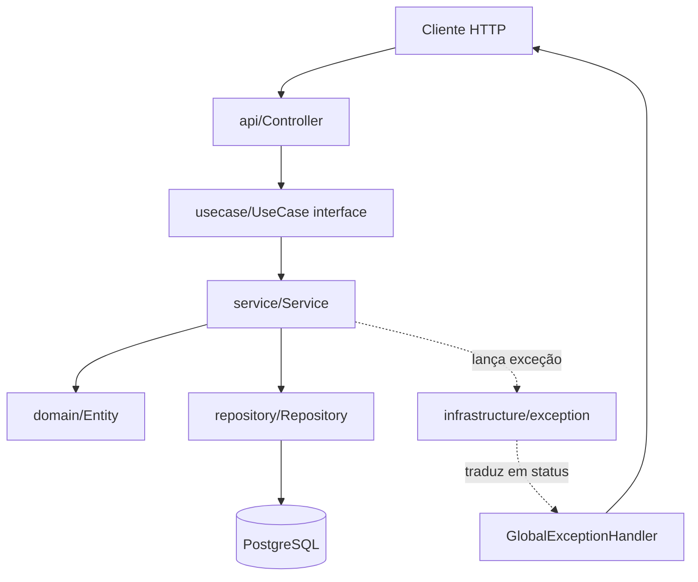

# Arquitetura

Como o código está organizado e por quê. Para os padrões de escrita, veja
[`convencoes.md`](convencoes.md). Para as decisões, veja os
[ADRs](adr/README.md).

## Visão geral

O projeto usa **Clean Architecture** com influência de **DDD**. O objetivo é isolar as regras de
negócio de detalhes de infraestrutura, de modo que trocar o banco ou o framework web não afete o
domínio.

O fluxo é sempre o mesmo e nessa ordem: **Controller → UseCase → Service → Entity/Repository**.

## Divisão de responsabilidades

| Pacote | Responsabilidade | Pode depender de |
| --- | --- | --- |
| `core/*/api` | HTTP: rotas, status, validação de entrada, Swagger | `usecase`, `api/dto` |
| `core/*/api/dto` | Contrato de entrada e saída da API | `domain` (só para o `fromEntity`) |
| `core/*/usecase` | Interface do caso de uso, sem implementação | `domain` |
| `core/*/usecase/command` | Intenção de escrita | — |
| `core/*/usecase/query` | Pedido de leitura | — |
| `core/*/service` | Orquestração e transação | `domain`, `repository` |
| `core/*/domain` | Regras de negócio e estado | **nada** |
| `core/*/repository` | Acesso a dados | `domain` |
| `infrastructure` | Detalhe técnico (segurança, e-mail, erro) | `core` |
| `shared` | Utilitários transversais | — |

A regra que importa: **`domain` não importa nada de fora dele.** Se uma entidade importa
`org.springframework.http`, o desenho está errado. Hoje as entidades usam anotações JPA
(`@Entity`, `@Column`), o que é uma concessão pragmática ao framework — está documentada no
[ADR 001](adr/001-padroes-arquiteturais.md).

## Módulos

O código está organizado por **feature**, não por camada técnica. Um módulo de feature é um
diretório com todos os seus tipos.

### `core/identity`

| Módulo | Responsabilidade |
| --- | --- |
| `address` | Entidade de endereço compartilhada entre pessoa física e jurídica. É a única entidade compartilhada entre features. |
| `user` | Autenticação, login, refresh token, papéis. |
| `naturalperson` | Pessoa física. |
| `legalperson` | Pessoa jurídica. |
| `familygroup` | Grupo familiar e o vínculo com pessoas físicas. |

### `core/academic`

| Módulo | Responsabilidade |
| --- | --- |
| `program` | Programa, categoria de programa e item de categoria (usado por educadores). |

### `infrastructure`

Configuração transversal: `config`, `security` (filtro JWT, CORS, rotas liberadas), `handler`
(tratamento global de erro), `email`, `exception`, `services`, `utils`.

### `shared`

`AuditableEntity` (datas e soft delete), `SpecificationBuilder` (filtro dinâmico) e as anotações
de validação (`@CPF` implícito pelo bean validation, `@RG`, `@Phone`, `@Cellphone`).

## Fluxo de uma requisição

Exemplo real: `POST /family-group`.

1. O `SecurityFilter` valida o `Authorization: Bearer` e monta o `SecurityContext`.
2. `FamilyGroupController.create` recebe o corpo, valida com `@Valid` e monta o
   `CreateFamilyGroupCommand` com `.withX(...)` para anexar o id da rota.
3. O controller chama `createUseCase.handle(command)`.
4. `CreateFamilyGroupService` roda dentro de uma transação: pede o próximo valor da sequence
   `friendlyId`, valida as regras de negócio chamando métodos do próprio `FamilyGroup`, e
   persiste via `FamilyGroupRepository`.
5. O service devolve a entidade. O controller converte com `FamilyGroupResponse.fromEntity` e
   responde `201` com o `Location`.

Exceções de qualquer camada sobem até o `GlobalExceptionHandler`, que as traduz para HTTP.

## Modelo de dados

Entidades persistentes, todas herdando de `AuditableEntity`:

| Entidade | Observações |
| --- | --- |
| `User` | Autenticação. Guarda papéis. Sem soft delete. |
| `NaturalPerson` | Pessoa física. Tem `@SQLRestriction("deleted_at IS NULL")`. |
| `LegalPerson` | Pessoa jurídica. |
| `FamilyGroup` | Grupo familiar. `friendlyId` é gerado por sequence do Postgres. |
| `Address` | Compartilhada, com `OneToOne` a partir de quem a possui. |
| `Program`, `Category`, `Item` | Núcleo acadêmico. |

### Vínculo de muitos para muitos

`FamilyGroup` e `NaturalPerson` se ligam por `family_group_natural_person`. Esse vínculo tem
consequências que valem saber:

- Não há entidade de junção com ID próprio, então **não há como consultar o vínculo isolado**
  pelas repositories padrão. Ver [`convencoes.md`](convencoes.md) para o padrão adotado.
- A mesma pessoa pode estar em vários grupos, e o vínculo não tem atributos próprios.
- Remover o vínculo **não** apaga a pessoa: as duas pontas têm ciclo de vida independente.

## Decisões com consequência estrutural

- **Consultas dinâmicas** usam `SpecificationBuilder`, não JPQL escrito à mão. Ver
  [ADR 001](adr/001-padroes-arquiteturais.md) e [`convencoes.md`](convencoes.md).
- **DTO de resposta é `record`** e a conversão fica num `fromEntity` estático. Isso mantém o
  contrato de saída explícito e impede que o controller vaze entidade para fora. Ver
  [ADR 008](adr/008-formato-dtos-api.md).
- **Testes de integração rodam em Postgres de verdade**, não em H2. Ver
  [ADR 007](adr/007-testcontainers-postgres.md).
- **`@SQLRestriction` filtra soft delete automaticamente.** Uma entidade nova com soft delete
  precisa da anotação, senão o filtro some.
